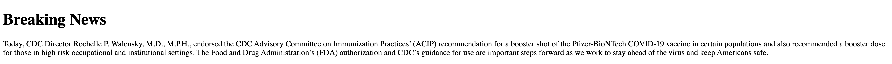

# Front End Tutorial

## Chapter 1 HTML

### Verse 1 - Environment Preparation

> MacOS

Make sure `vim` is available, typically MacOS is equipped with this code editor before hitting the store, so you don’t have to manuelly install it.

Run this to check availability:

```bash
vim
```

You should be able to see a welcome interface.

To edit in **Vim**, input `i` to invoke insert mode, in which you can finally edit the code. Notice this, in **Vim**, originally the mouse is nullified, if you try to activate mouse functions(this is optional), create a file named `~/.vimrc` to permanently modify settings for **Vim**. Step by step goes like this:

> First we create `~/.vimrc` via **Vim**
>
> ```bash
> vim ~/.vimrc
> ```

> Then we insert some lines, besides activating mouse functions, we can also do more to make the interface more friendly.
>
> ```bash
> set nu			# This is to show line numbers
> set mouse=a		# This is to activate mouse functions
> set sw=4		# The following lines are to set tab length 4
> set ts=4
> set sts=4
> ```

> Done! Let’s save our changes and quit. Notice, this command receiver is invoked by `:`, only when we input `:`, such commands can be responded.
>
> So actaully you cannot simply copy and paste the following line, you are supposed to first input `:`, then input `w` and `q` in order, where `w` means “save” and `q` means “quit”.
>
> ```
> :wq
> ```

After this, let’s modify our `~/.bash_profile`, which could permanently store some frequently-used tools. Run this to edit the file:

```bash
vim ~/.bash_profile
```

After entering into the file, use what we have learnt, insert the following lines:

```bash
alias chrome="/Applications/Google\ Chrome.app/Contents/MacOS/Google\ Chrome"
alias vscode="/Applications/Visual\ Studio\ Code.app/Contents/MacOS/Electron"
```

Make sure you have already installed **Chrome browser** and **VSCode code editor** in advance. Besides, pathes of the two may vary on different computers, if they are different with mine, change what after `=` accordingly.

Try to verify correctness by running these in `Terminal`:

```bash
chrome
vscode
```

Expectedly, **Chrome browser** and **VSCode code editor** will open immediately.

------

NOW, all the work pertaining environment preparation have been done.


### Verse 2 - What is Git, Seriously?

Git’s slogan is:

**"Everything is local."**

And it is not bluffing.

You can regard it as if there is a remote servant who is handling your codes, and you can always tell the guy to store or fetch your codes. So can your friends, unless they are not permitted by you. Sounds like a bank or something, huh? This is good, because you can collaborate while don’t have to worry about losing your codes somehow.

There are several frequently used **Git** commands:

```bash
git add .
git commit -a -m "some information to mark this commit"

git push -u origin master#branch

git pull
```

First two always work together, they are to commit local changes but without pushing them. The third is to push your local changes to the remote server, where you can store your code and fetch from. The fourth is to pull from the remote server, which you can update your local codes to the remote server.

Though all of these we’ve discussed, there is definitely still a lot that we cannot quite understand, like `-a`, or `origin`, `master`. But don’t worry, we’ll get into them later on in our practices.


### Verse 3 - Write your first `.html`

HTML is kind of a programming language, but it is plain-speaking.

Let’s look at this example code:

```html
<!DOCTYPE html>

<html>
    <head>
        <title>SprLau's Web Design Learning</title>
    </head>

    <body>
        <h1>About Me</h1>
        <p>I am a junior year student majoring in computer science.</p>
        <p>To know more about me, please search on <a href="http://www.baidu.com">Baidu</a>.</p>
    </body>
</html>
```

Now let’s dissect it…

#### `<!DOCTYPE html>`

The `<!DOCTYPE>` declaration represents the document type, and helps browsers to display web pages correctly.

It must only appear once, at the top of the page (before any HTML tags).

The `<!DOCTYPE>` declaration is not case sensitive.

The `<!DOCTYPE>` declaration for HTML5 is

```html
<!DOCTYPE html>
```

#### `<html></html>`

The HTML document itself begins with `<html>` and ends with `</html>`.

#### `<head></head>`

This shows the title in the bar.

#### `<body></body>`

The visible part of the HTML document is between `<body>` and `</body>`.

#### `<h1></h1>`

This declares a Size 1 header, quite bold.

#### `<p></p>`

This declares a paragraph, a plain text.

#### `<a href></a>`

This declares a link, any link, on which click to visit.

> The real output should be like this:
>
> 
>
> Try to match every element on this page to the code.

***Try yourself!!!***


### Verse 4 - What if I want to add some pics?

```html

```

This code above declares an image added to your website. Based on the previous code, let’s implement by adding an image:

```html
<!DOCTYPE html>

<html>
    <head>
        <title>SprLau's Web Design Learning</title>
    </head>

    <body>
        <h1>About Me</h1>
        <p>I am a junior year student majoring in computer science.</p>
        <p>To know more about me, please search on <a href="http://www.baidu.com">Baidu</a>.</p>
        <p>This is my favorite cat:</p>
        
    </body>
</html>
```

> The page should be look like this:
>
> 

Quite weird, right? Why Punggaw Cat is so flat??? So, if you want to keep the **actual size** of a pic, don’t manually set `width` and `height`:

```html
<!DOCTYPE html>

<html>
    <head>
        <title>SprLau's Web Design Learning</title>
    </head>

    <body>
        <h1>About Me</h1>
        <p>I am a junior year student majoring in computer science.</p>
        <p>To know more about me, please search on <a href="http://www.baidu.com">Baidu</a>.</p>
        <p>This is my favorite cat:</p>
        
    </body>
</html>
```

> 
>
> The size is normal. So big… I can’t even cut the whole page.


### Verse 5 - What is an *Attribute*?

Consider this:

**“Anything behand the first word after < is an attribute.”**

For instance, recall this: ``

Here `img` is the first word after <, so `src, alt, width, height` are all attributes.

`<p></p>` has attribute options as well, the most frequent one among them is **the style attribute**:

```html
<p style="color:blue;">My favorite color is blue.</p>
```

Without the style attribute, it is just a plain text; with the style attribute, the text is blue in color.

> 

You can also declare a color with its hex code, like `#FFFFFF`, where `#` identifies a hex code.

In this way, you can declare colors in a more accurate way, which is also strongly recommeded.

```html
<p style="color:#B4C5D8;">My favorite color is iceberg blue.</p>
```

> 

You can also add a *title* attribute to a `<p></p>`:

```html
<p title="My Favorite Color" style="color:#B4C5D8;">My favorite color is iceberg blue.</p>
```

After you add this, the effect is not so visible as the precious ones. If you want to see the title of an element, move your mouse to the element and hold there for seconds, then the title reveals:


#### Summary

All HTML elements can have **attributes**:

- The `href` attribute of `<a>` specifies the URL of the page the link goes to
- The `src` attribute of `` specifies the path to the image to be displayed
- The `width` and `height` attributes of `` provide size information for images
- The `alt` attribute of `` provides an alternate text for an image
- The `style` attribute is used to add styles to an element, such as color, font, size, and more
- The `lang` attribute of the `<html>` tag declares the language of the Web page
- The `title` attribute defines some extra information about an element


### Verse 6 - Headings

Remember that `<h1></h1>` element? That’s the first type of headings.

In total, there are 6 kinds of headings:

```html
<h1>Heading 1</h1>
<h2>Heading 2</h2>
<h3>Heading 3</h3>
<h4>Heading 4</h4>
<h5>Heading 5</h5>
<h6>Heading 6</h6>
```

These headings help to keep a website in a good shape, logically. Imagine a book’s catalog.

As we know, the default sizes of these headings is settled; what if I want to make `<h1></h1>` smaller and `<h6></h6>` larger?

The answer is, again, attributes.

We can simply add a **style** attribute to a heading:

```html
<h1 style="font-size:5px;">Heading 1</h1>
```

Now let‘s add this to our code:

```html
<!DOCTYPE html>

<html>
    <head>
        <title>SprLau's Web Design Learning</title>
    </head>

    <body>
        <h1>About Me</h1>
        <p>I am a junior year student majoring in computer science.</p>
        <p>To know more about me, please search on <a href="http://www.baidu.com">Baidu</a>.</p>
        <p>This is my favorite cat:</p>
        
        <p title="My Favorite Color" style="color:#B4C5D8;">My favorite color is iceberg blue.</p>

        <h1 style="font-size:5px;">Education</h1>
    </body>
</html>
```

> 
>
> Here, 👆, quite small huh, but this is what we want: to make a heading 1 smaller.


### Verse 7 - Paragraphs

We’ve touched this as well. `<p></p>` declares things between it are paragraphs.

Previously, we only have 1 sentence in a paragraph; however, what if we want to add several sentences to it? Like:

```
Beihang University, 
School of Computer Science and Engineering, 
Bachlor of Engineering.
```

Maybe we could:

```html
<p>
        Beihang University, 
        School of Computer Science and Engineering, 
        Bachelor of Engineering.
</p>
```

However, if we do this, you’ll surprisingly notice that the line feed we want disappears:


Why is this?

The reason is that *HTML* will automatically remove any extra spaces and lines when the page is displayed.

So, is there any solution to this problem? Of course! Just append a `<br>`, this is the short for **break**, to every place we want a line feed:

```html
<p>
        Beihang University, <br>
        School of Computer Science and Engineering, <br>
        Bachelor of Engineering.
</p>
```

Now we get what we want:


You can also use `<pre></pre>` to do this job. The text inside a `<pre>` element is displayed in a fixed-width font (usually Courier), and it preserves both spaces and line breaks:

```html
<pre>
        Beihang University, 
        School of Computer Science and Engineering, 
        Bachelor of Engineering.
</pre>
```

>  This is what it looks like:
>
>  
>
>  Quite strange, so not recommended.


### Verse 8 - Styles

Totally, we can add 5 styles to any text element:

- Use `background-color` for background color
- Use `color` for text colors
- Use `font-family` for text fonts
- Use `font-size` for text sizes
- Use `text-align` for text alignment
- Use `font-weight` for bold

We can add only one or two of them; we can also add several, even all of them:

```html
<p style="background-color: #C3C4C7; color: #FF0000; font-family: Courier; font-size:20px; text-align:center; font-weight:bold">
    I am currently in my junior year.
</p>
```

> The look should be like:
>
> 


### Verse 9 - Formatting

Remember we used the attribute `font-weight` to declare a **bold** text?

Is there any method that is more straightforward? The answer is yes. Actually, there a many text formats that can be given in a straightforward way, and we consider every of them a distinct element:

- `<b>` - Bold text
- `<strong>` - Important text
- `<i>` - Italic text
- `<em>` - Emphasized text
- `<mark>` - Marked text
- `<small>` - Smaller text
- `<del>` - Deleted text
- `<ins>` - Inserted text
- `<sub>` - Subscript text
- `<sup>` - Superscript text

Here is an example:

```html
<p>
    My research interests mainly are: <br>
    <b>Visual Compuring</b>: <em>Vision & Graphics</em><br>
    <i>Human-computer Interaction</i>: <strong>Text Entry & User Interface</strong><br>
    Besides, I am seeking for <mark>intern opportunities</mark>.<br>
    <small>You can reach me via email</small>: lau@buaa.edu.cn<br>
    I am also a <del>qualified sleeper</del> and <ins>an amatuer musician</ins>.<br>
    My <sub>love for life</sub>: <sup>PungGaw</sup>!!!
</p>
```

> It should look like this:
>
> 


### Verse 10 - Quotation and Citation Elements

We will go through the `<blockquote>`,`<q>`, `<abbr>`, `<address>`, `<cite>`, and `<bdo>` HTML elements in this verse.

`<blockquote></blockquote>` contains a long quotation. Like this:

```html
<blockquote>
 	The unique fame that Leonardo enjoyed in his lifetime and that, filtered by historical criticism, has remained undimmed to the present day rests largely on his unlimited desire for knowledge, which guided all his thinking and behaviour. An artist by disposition and endowment, he considered his eyes to be his main avenue to knowledge; to Leonardo, sight was man’s highest sense because it alone conveyed the facts of experience immediately, correctly, and with certainty.
</blockquote>
```

> This looks like:
>
> 

We can also quote a relatively short sentence like this:

```html
<p>My goal is to: <q>Bridge the gap between technology and human.</q></p>
```

This will automatically add quotation marks:


`<abbr></abbr>` declares an abbreviation. Marking abbreviations can give useful information to browsers, translation systems and search-engines:

```html
<p><abbr title="Human-computer Interaction">HCI</abbr> is my favorite field.</p>
```


Like the title attribute we talked about earlier, put your mouse onto it then the full name would be shown.

`<address></address>` defines an address. The contact information can be an email address, URL, physical address, phone number, social media handle, etc.

```html
<address>
    Beihang University, <br>
    37, Xueyuan Rd. <br>
    Beijing, CN
</address>
```


Then, the HTML `<cite>` tag defines the title of a creative work (e.g. a book, a poem, a song, a movie, a painting, a sculpture, etc.).

```html
<p>My favorite book: <cite>The Godfather</cite> by Mario Puzo.</p>
```


Lastly, and this may be useless in most of the circumstances, but what we know can’t hurt us, right? Here we discuss `<bdo></bdo>`. BDO stands for Bi-Directional Override.

```html
<bdo dir="rtl">This text will be written from right to left</bdo>
```


The `dir` attribute stands for *right to left*.


### Verse 11 - Comments

If you want to add some annotations, or notes, just add a comment like this:

```html
<!-- This is a comment -->
```

Computers pay no attention to comments; comments are there for human to have a better understanding of the code.

For example:

```html
<bdo dir="rtl">This text will be written from right to left</bdo>
<!-- bdo stands for Bi-directional override, and rtl means right to left -->
```

You can have a better understanding from this comment, and the computer would pay no attention to it.


### Verse 12 - Color

You can set a color for text and its background and border, plaily and simply.

Here we use a `<p></p>` (paragraph) to demonstrate this:

```html
<p style="color: blueviolet; background-color: cyan; border: 5px solid yellow;">Try some colors.</p>
```

> 


### Verse 13 - CSS

HTML defines what a website contains, while CSS defines how the contents look like. Consider it as a decoration. Typically, we have internal CSS and external CSS. Internal means coding the CSS and the HTML in the same `.html` file; however, we all are used to code the CSS in an external, seperate `.css` file.

We can include a `.css` file to an `.html` with:

```html
<link rel="stylesheet" href="THE_LINK_OF_A_CSS">
```

where `rel="stylesheet"` means it is a “**style sheet file**”, a.k.a. CSS; `href` has the same meaning as we’ve learnt: defining a link.

Let me demonstrate by actually making a site:


The `.html` of it is supposed to be written first, since contents count most:

```html
<!DOCTYPE html>

<html>
    <head>
        <link rel=" stylesheet" href="../CSS/external.css">
        <!-- We will get to this external.css later -->
        
        <title>Using External CSS</title>
    </head>

    <body>
        <h1>Breaking News</h1>
        <p>Today, CDC Director Rochelle P. Walensky, M.D., M.P.H., endorsed the CDC Advisory Committee on Immunization Practices’ (ACIP) recommendation for a booster shot of the Pfizer-BioNTech COVID-19 vaccine in certain populations and also recommended a booster dose for those in high risk occupational and institutional settings. The Food and Drug Administration’s (FDA) authorization and CDC’s guidance for use are important steps forward as we work to stay ahead of the virus and keep Americans safe.
        </p>
    </body>
</html>
```

> If you open the `.html` file now, you’ll see some plain texts:
>
> 

Now let’s write a `.css` for it, here we create the file in `../CSS/` as `external.css` (`..` means the parent of the current directory):

```css
p {
    color: blue;
    background-color: bisque;
    border: 3px solid red;
    padding: 3px;
    font-family: 'Courier New', Courier, monospace;
}

h1 {
    text-align: center;
    font-weight: bold;
    font-family:'Gill Sans', 'Gill Sans MT', Calibri, 'Trebuchet MS', sans-serif;
    font-size: 200%;
}
```

See, a `.css` file is simple. Frankly list everything and you get it.

Now that we have already included the `.css` file by `<link rel=" stylesheet" href="../CSS/external.css">` in the `.html` file, we are done!

Try to examine the page by clicking on `using_external_css.html` (*not on GitHub but from local disk):


So, CSS really is a powerful tool especially when we have **static** styles for each element. Using external CSSes to define the style is also industrially-expected, so get used to it. Now that this is only a **first glance** of CSS, we will learn more thoroughly about it when we finish HTML.


### Verse 14 - Links

Websites are all about links, so it must be understood. 

```html
<a href="URL">LINK_TEXT</a>
```

The most important attribute of the `<a>` element is the `href` attribute, which indicates the link's destination. The *link text* is the part that will be visible to the reader. Clicking on the link text, will send the reader to the specified URL address.

And you may have encountered situations like opening a website that wipes out your currently reading one, making you have to go back and click the right button to make it open in a new tab. Quite inconvenient! So, we have an attribute here `target`: 

The `target` attribute can have one of the following values:

- `_self` - Default. Opens the document in the same window/tab as it was clicked
- `_blank` - Opens the document in a new window or tab
- `_parent` - Opens the document in the parent frame
- `_top` - Opens the document in the full body of the window

An example:

```html
<a href="https://sprlau.github.io/" target="_blank">Visit SprLau's Site!</a>
```

Try this in the [index.html](./HTML/index.html).

You can also make an image that can be clicked to visit a link.

```html
<a href="https://sprlau.github.io/" target="_blank">
	
</a>
```

What if you want to send an E-mail?

```html
<a href="mailto:lau@buaa.edu.cn" target="_blank">Send SprLau a mail!</a>
```

#### Summary

- Use the `<a>` element to define a link
- Use the `href` attribute to define the link address
- Use the `target` attribute to define where to open the linked document
- Use the `` element (inside `<a>`) to use an image as a link
- Use the `mailto:` scheme inside the `href` attribute to create a link that opens the user's email program


### Verse 15 - Block and Inline

Every HTML element has a default display value, depending on what type of element it is.

There are two display values: block and inline.

------

A block-level element always starts on a new line.

A block-level element always takes up the full width available (stretches out to the left and right as far as it can).

A block level element has a top and a bottom margin, whereas an inline element does not.

Here are the block-level elements in HTML:

```
<address>     <article>     <aside>     <blockquote>     <canvas>     <dd>     <div>     <dl>     <dt>     <fieldset>     <figcaption>     <figure>     <footer>     <form>     <h1>-<h6>     <header>     <hr>     <li>     <main>     <nav>     <noscript>     <ol>     <p>     <pre>     <section>     <table>     <tfoot>     <ul>     <video>
```

Notwithstanding, an inline element does not start on a new line.

An inline element only takes up as much width as necessary.

Here are the inline elements in HTML:

```
<a>     <abbr>     <acronym>     <b>     <bdo>     <big>     <br>     <button>     <cite>     <code>     <dfn>     <em>     <i>          <input>     <kbd>     <label>     <map>     <object>     <output>     <q>     <samp>     <script>     <select>     <small>     <span>     <strong>     <sub>     <sup>     <textarea>     <time>     <tt>     <var>
```

#### `<div>`

The `<div>` element is often used as a container for other HTML elements.

The `<div>` element has no required attributes, but `style`, `class` and `id` are common.

When used together with CSS, the `<div>` element can be used to style blocks of content:

```html
<div style="background-color:black;color:white;padding:20px;">
  <h2>London</h2>
  <p>London is the capital city of England. It is the most populous city in the United Kingdom, with a metropolitan area of over 13 million inhabitants.</p>
</div>
```

#### `<span>`

The `<span>` element is an inline container used to mark up a part of a text, or a part of a document.

The `<span>` element has no required attributes, but `style`, `class` and `id` are common.

When used together with CSS, the `<span>` element can be used to style parts of the text:

```html
<p>My mother has <span style="color:blue;font-weight:bold">blue</span> eyes and my father has <span style="color:darkolivegreen;font-weight:bold">dark green</span> eyes.</p>
```


### Verse 16 - `<class>`

The HTML `class` attribute is used to specify a class for an HTML element.

Multiple HTML elements can share the same class.

#### Using The `<class>` Attribute

The `class` attribute is often used to point to a class name in a style sheet. It can also be used by a JavaScript to access and manipulate elements with the specific class name.

In the following example we have three `<div>` elements with a `class` attribute with the value of "city". All of the three `<div>` elements will be styled equally according to the `.city` style definition in the head section. Notice that `<class>` can be used independently and dependently:

> Click here to see an example: [class_example.html](HTML/class_example.html)

#### Summary

- The HTML `class` attribute specifies one or more class names for an element
- Classes are used by CSS and JavaScript to select and access specific elements
- The `class` attribute can be used on any HTML element
- The class name is case sensitive
- Different HTML elements can point to the same class name
